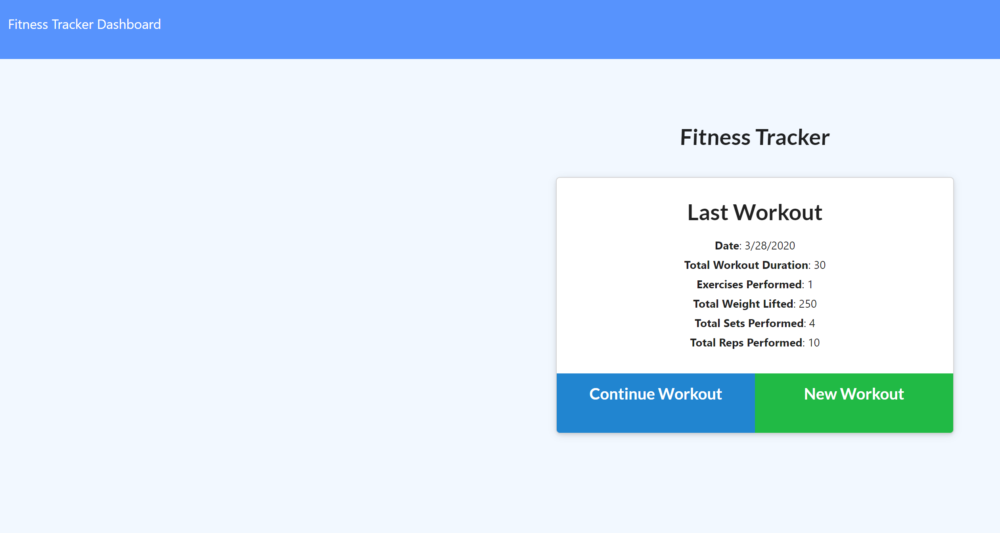

# github.io-Fitness


## Description

The puerpose of this project is to provide a workout tracker for user's to log personal exercise tasks and post to a chart. 

## User Story

```
As a user, I want to be able to view create and track daily workouts. 
I want to be able to log multiple exercises in a workout on a given day.
I should also be able to track the name, type, weight, sets, reps, and duration of exercise.
If the exercise is a cardio exercise, I should be able to track my distance traveled.

Business Context
A consumer will reach their fitness goals quicker when they track their workout progress.

```
## Functionality GIF



## How It Works

* User runs 'npm install' for dependencies in the terminal
* User also runs 'npm run seed'
* Initiates from the command 'node server.js' in the terminal
* User is prompted with an exercise input box to add workout progress
* User can save workout to update in personal chart 

## Link

 https://andreathomas19460.github.io/github.io-Fitness/
 

## Status 

In progress (workout not updating in stats chart)

## Author

Andrea Thomas

